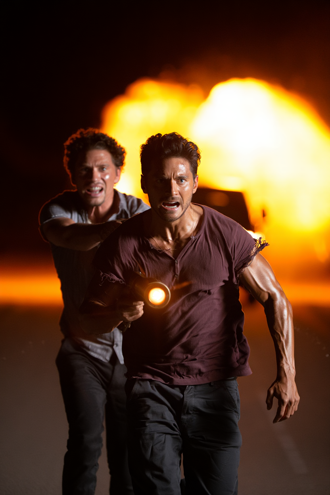
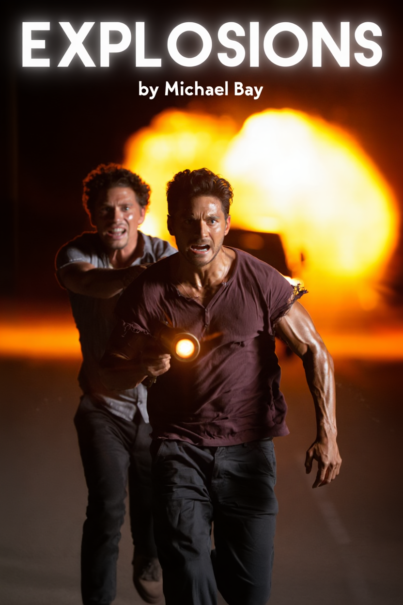

# Use Reve to make movie posters

To get text character forms to work better for non-ASCII languages, this
example renders the letters using a unicode font to a reference bitmap, and
provides it as reference to the /v1/images/remix endpoint.

## Usage

```bash
# Make a budget at api.reve.com/console, and then an API key for that budget.
export REVE_API_KEY=papi....

python3 makeimage.py --prompt "Two muscular men dressed in ripped short sleeves run towards the camera, fear and determination in their faces. Behind them, a giant explosion lights up the night sky. The front of the mens faces is lit by a strong searchlight, whereas the back is outlined against the fireball illuminating the entire scene." --output "image.png"

python3 makeposter.py --title "EXPLOSIONS by Michael Bay" --image "image.png" --output "poster.png"
```

This approach has about a 70% success rate, so you may need to generate more
than one combined output before you get an acceptable result, especially for
longer titles and output fonts that are vastly different from the Noto Sans
font used for illustration.

If you need CJK or emoji support, you may need to adapt this code to import and
use the appropriate fonts for those use cases.

## Initially generated image



## Composed Poster



## Licenses

This code is made available under the MIT open source license, which is hereby
incorporated by reference. The copyright holders is &copy; Reve AI 2025, All Rights Reserved.

This repository contains a copy of the Noto-Sans font, available from Google
Fonts under the Open Fonts License.

